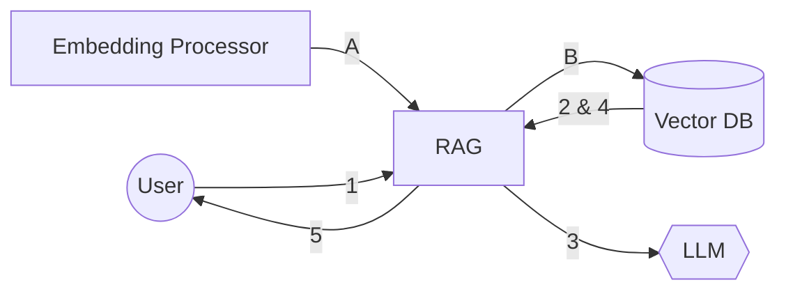

A Retrieval-Augmented Generation (RAG) pipeline is a technique for interfacing with LLMs that helps to:

- Add Context
- Improve Accuracy
- Check / Filter hallucinations
- Preserve Privacy
- Add Value

In this age where LLMs are becoming ubiquitous you will very likely need to create one of these sooner or later.

<!--more-->

## Basic Flow

There are two distinct flows that need to be performed. The first is the embedding flow, which reads and stores data not directly accessible to the LLM. It vectorizes the data and hands it to the RAG for storage in the Vector DB. Following {}, it is important that the RAG be the only system with direct access to the Vector DB.

Separately the Query flow starts with the user asking a question.  The RAG system may (or may not) pull data from the Vector DB to augment the query with context the LLM doesn't have.  Care has to be taken to ensure that no IP is leaked to the LLM because queries are considered public and may be used in future LLM training.  After the LLM response is returned the RAG can additionally augment the response with embedded context from the Vector DB before handing it back to the user.

## RAG Service

The RAG service should be a simple HTTP service that has 2 types of endpoints.  The first type will be the CRUD API for the embedding flow.  The second is the streaming API for  the query flow.

### Embedding API

The Embedding API should be your standard CRUD operations.  You would be well served using an {} server.  If at all possible we recommend taking the raw data in the API and then vectorizing it in the service for storage in Vector DB.

### Query API

The Query API should "stream" the response.  There are a few ways to do this which will effect what deployment options you have.  One of the easier ways - from the server perspective - is websockets.  However, not all loadbalancers or WAFs supoport that.  Another option is a {}, though that comes at the disadvantage of requiring a separate DB to keep track of the cursors.

### Deployment Options

Your simplest option is a serverless function or container.  That service would take care of the API endpoint and then you largely just have to make sure that your code completes before the service timeouts.

A {} Deployment is another viable option.  Expose the endpoimt via an Ingress though a high performance IngressController and you should be all set.
