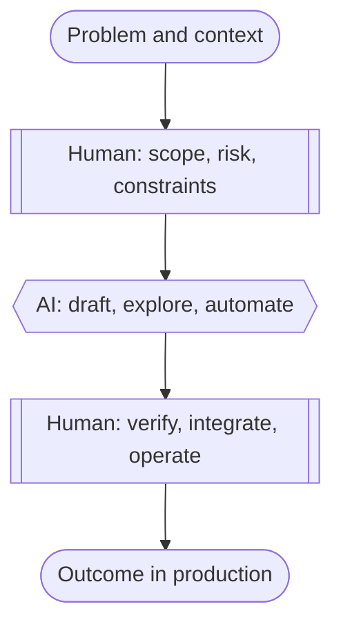

A lot of developers feel career anxiety about AI. Some of that is hype. Some is backed by data. The backed part is often contradictory: big productivity gains in one study, a slowdown in another, softer junior hiring in payroll data.

Here we talk about what the data actually means and what you can do about it.

<!--more-->

## The Contradictions

Headlines on AI and developer careers often contradict each other. That is not a reason to ignore the data. It is a reason to read carefully.

### Productivity Is Real, but the Number Depends on the Study

**Conclusion:** AI helps on many tasks. Throughput metrics and self-reported speed do not tell the whole story. One headline percentage is a weak basis for a career plan.

- [MIT field RCTs, 2024](https://economics.mit.edu/sites/default/files/inline-files/draft_copilot_experiments.pdf): about **26%** more completed tasks with Copilot across roughly 4,900 developers.
- [GitHub lab study, 2022](https://github.blog/news-insights/research/research-quantifying-github-copilots-impact-on-developer-productivity-and-happiness/): **55%** faster on a bounded coding task.
- [Jellyfish working paper](https://fion.ac/jellyfish.pdf): about **8.7%** faster task completion at adopting firms; quality measures did not decline.
- [NAV IT longitudinal study, 2025](https://arxiv.org/pdf/2509.20353): no statistically significant change in commit metrics after Copilot rollout.

### The Labor Market Is Squeezing the Bottom Rung

**Conclusion:** This is not "no software jobs." The backed worry is **fewer classic junior slots** for work models can draft quickly.

- [Stanford Digital Economy Lab, 2025](https://digitaleconomy.stanford.edu/app/uploads/2025/12/CanariesintheCoalMine_Nov25.pdf): workers aged **22-25** in AI-exposed occupations saw roughly **16% relative** employment decline vs less-exposed roles.
- Same study, software developers: employment for that cohort fell nearly **20%** from its late-2022 peak by September 2025. Experienced workers in the same occupations did not show the same pattern.

### Experienced Work Does Not Automatically Get Faster

**Conclusion:** Speed is not the same as **correctness, operability, and accountability**. That gap is where durable careers still live.

- [METR RCT, 2025](https://metr.org/blog/2025-07-10-early-2025-ai-experienced-os-dev-study/): experienced open-source contributors took **19% longer** with AI allowed; many still felt faster. See also [a critique of the study design](https://substack.the-experimentalist.com/p/critiquing-the-metr-productivity).
- [Stack Overflow Developer Survey, 2025](https://survey.stackoverflow.co/2025/AI): **46%** actively distrust AI accuracy; **66%** frustrated by "almost right" output.

## What It Means

The backed data points to uneven tools, pressure on junior hiring, and persistent need for human judgment. That maps to two practical views: what tends to hold up and what is most exposed.

### What Holds Up Better

No title comes with a guarantee. The studies do not rank job titles. They do suggest where humans are still needed:

- **Production ownership.** Site reliability, incident command, and on-call culture exist because outages have cost, blameless learning, and a named owner. AI can suggest runbook steps. It does not carry the pager or explain a missed SLO to leadership.
- **Security and adversarial thinking.** Threat modeling, incident response, application security, and offensive research assume an opponent who adapts. Generated code can be wrong in subtle ways. Trust boundaries and "did we actually fix prod?" need skeptical humans.
- **Platform and infrastructure at org scale.** Identity, networking, cost, compliance, and migration history are specific to your employer. Models rarely have your full graph. The engineer who can reason across that graph stays relevant.
- **Regulated and high-stakes domains.** Healthcare, finance, defense, and safety-related embedded systems add liability, audits, and sign-off workflows. Tools accelerate drafts. Humans still sign.
- **Architecture and technical leadership.** Tradeoffs across teams, legacy, and multi-year bets are political and technical. Models propose options. They do not own the decision when the bet fails.
- **Customer-trusted technical roles.** Solutions architecture, forward-deployed engineering, and staff roles on revenue-critical accounts combine judgment, communication, and delivery under scrutiny.
- **Building and operating AI systems.** Evaluation, guardrails, observability, cost control, data pipelines, and human review loops are busy fields. Adoption ran ahead of trust.
- **Domain depth plus shipping.** The durable builder is often "engineer plus billing, logistics, clinical workflow, or security operations," not a generic feature author.

If your résumé already shows multi-stakeholder delivery and production cutover risk, you may already be closer to these patterns than the anxiety headlines suggest.

### What Is Most Exposed

Some of the career anxiety maps here. These roles lean on **throughput without ownership**:

- Spec-driven UI and API work with no system context
- Thin integration glue with no failure-mode analysis
- Roles measured by merges, not by prod outcomes
- Documentation or boilerplate factories disconnected from operations

Models are strongest on spec-and-output work with little system context. They still do not own a bad deploy, a security incident, or a wrong architectural call across three teams.

## What to Do About It

The studies conflict. Our read is that productivity gains are real but uneven; junior hiring is under pressure; experienced work still needs human judgment and trust.

"AI-proof" is the wrong goal. **Accountability-proof** is closer to the truth. While there are no guarantees, the following are our recommendations:

- **Own outcomes, not keystrokes.** Measure success by latency, reliability, cost, security posture, and customer results, not lines and commits. Tie your work to prod or business risk.
- **Verify before you trust.** Treat model output like a fast junior: useful, needs review. Specify intent in verifiable slices. Use tests and static analysis. Stage carefully. Reject the first answer when it does not hold up.
- **Think in systems, not syntax.** Syntax is table stakes. Build skill in data flow, failure modes, boundaries, operability, and evolution across services you did not write.
- **Learn AI orchestration.** This is not prompt trivia. Assemble context from repos, runbooks, tickets, and metrics. Decompose work. Parallelize where safe. Gate risky changes. Write down why you chose a path.
- **Go deep in one scarce lane.** Pick security, data, distributed systems, a regulated industry, hardware-adjacent work, or AI infra and eval. Shallow feature-only generalists face the most hiring pressure in the data.
- **Invest in communication and trust.** Write clear RFCs. State tradeoffs honestly. Be willing to be the person called when production is on fire.
- **Retool without panic.** Tooling will churn. Adopt workflows on real projects. Measure speed **and** defect rate. Keep what works. Neither "ignore AI" nor "AI replaced me" is a strategy.

### A Simple Mental Model

The durable career is the human + AI. As the human, you scope risk and constraints, then verify and operate in production. Let AI draft and explore in the middle.

Your response is not to code less. It is to **ship correct, valuable systems** with AI as labor, and to lean on taste, verification, and trust when the model is only almost right.
