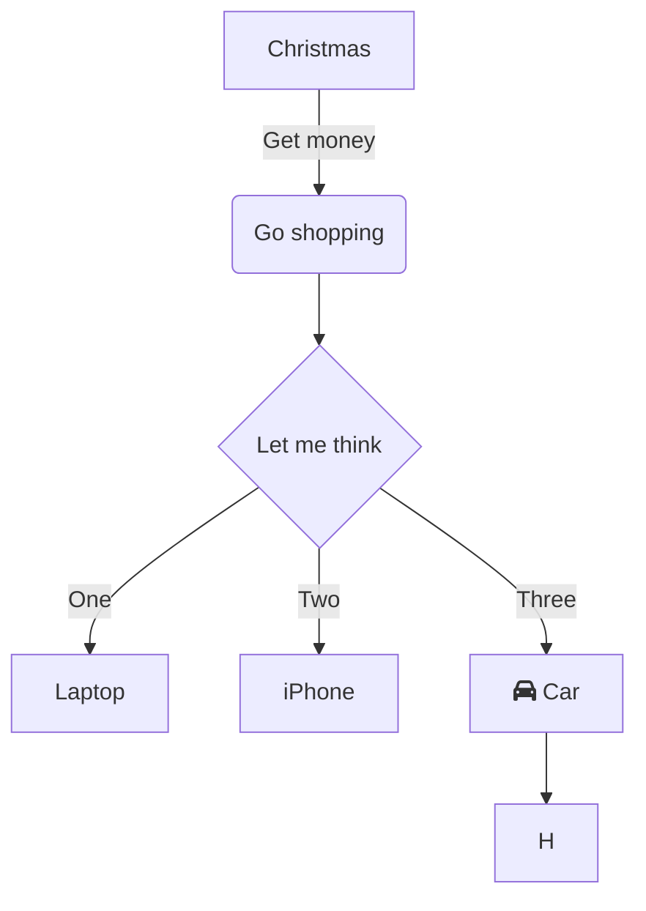

Testing the style of the site.

<!--more-->

## Heading 2

### Heading 3

#### Heading 4

##### Heading 5

##### Heading 6

## List

- Unordered hash
- 2
- 3

- [ ] Task
- [x] Completed

1. Ordered
    1. Sub
2. Another

## Formats

**Bold**

*Italic*

~strikethrough~

`inline code`

```go
func main() {
  fmt.Println("Hello")
}
```

## Table

| Header | 2 |
| ------ | - |
| cell   | 3 |

## Blockquote

> This is the quote

## Mermaid



## Callouts

> [!NOTE]
> This is a note.
