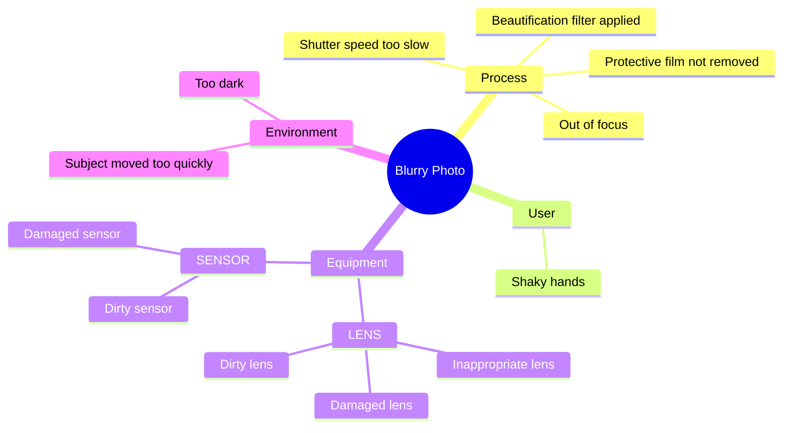

[Fishbone diagram](https://en.wikipedia.org/wiki/Ishikawa_diagram) (Ishikawa or cause-and-effect diagram) maps a problem at the "head" and sorts possible causes into branching categories along the spine. We **assess** it because it structures postmortem brainstorming when several factors may contribute, but it needs facilitation and a follow-up drill-down. It belongs under **[[Technique]]** with **[[Incident Management]]** and **[[SRE]]** learning practices. Use it when a failure has multiple plausible branches, then run **[[Five Whys]]** on each rib.

## Blurb

> A fishbone diagram is a quality tool that helps users identify the many possible causes for a problem by sorting ideas into useful categories.

## Summary

Fishbone diagrams shine when a problem has **multiple contributing dimensions** and a single Five Whys chain would miss parallel causes. The problem sits at the head; category ribs collect candidate causes; sub-causes branch off each rib.

| Step | Action |
|------|--------|
| 1 | Write the problem statement as an agreed fact |
| 2 | Pick 4-6 categories the team understands |
| 3 | Brainstorm causes on each rib without debating fixes yet |
| 4 | Run **[[Five Whys]]** on the highest-signal branches |
| 5 | Convert roots into process, guardrail, or automation action items |

**Diagram format:** Classic fishbone on a whiteboard works in the room. For docs in Git, **[[Mermaid]]** mindmaps are often easier to maintain than beta fishbone syntax. Same shape: root = problem, branches = cause paths.

**Sibling technique:** **[[First Principles]]** applies when designing forward from constraints, not when mapping an incident backward.


## Details

### Common Category Sets

Pick labels the team already uses. Rename freely; clarity beats jargon.

| Set | Categories |
|-----|------------|
| **6Ms (manufacturing)** | Manpower, Machine, Method, Material, Measurement, Mother Nature (environment) |
| **4Ss (service)** | Surroundings, Suppliers, Systems, Skills |
| **Ops/postmortem** | People, Process, Tooling, Environment, Measurement |

### [[Mermaid]] Options

| Format | Status | Best for |
|--------|--------|----------|
| `ishikawa-beta` | Beta in **[[Mermaid]]** | Fishbone-shaped diagrams in docs |
| `mindmap` | Stable | Version-controlled cause trees; easier day-to-day editing |

Here is the example in both formats on the same "Blurry Photo" problem.

```plain
ishikawa-beta
    Blurry Photo
    Process
        Out of focus
        Shutter speed too slow
        Protective film not removed
        Beautification filter applied
    User
        Shaky hands
    Equipment
        LENS
            Inappropriate lens
            Damaged lens
            Dirty lens
        SENSOR
            Damaged sensor
            Dirty sensor
    Environment
        Subject moved too quickly
        Too dark
```




### Integration with Five Whys

Fishbone answers **where to look**. Five Whys answers **how deep to dig** on each branch. Do not stop at the fishbone brainstorm; shallow ribs produce shallow fixes.
