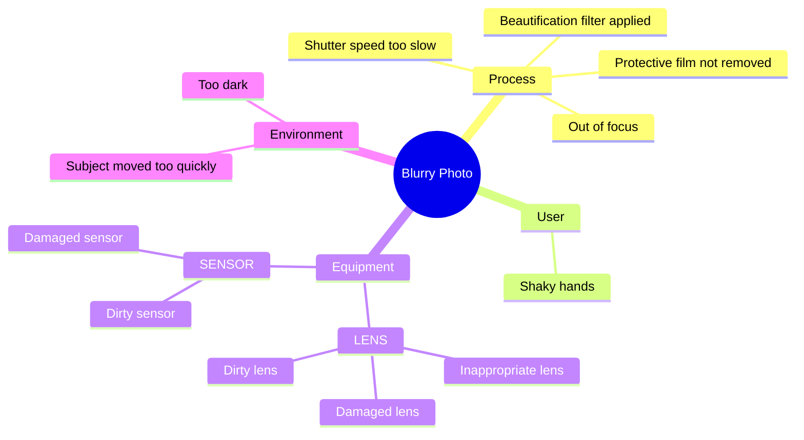

[Fishbone diagram](https://en.wikipedia.org/wiki/Ishikawa_diagram). (Ishikawa or cause-and-effect diagram) maps a problem at the "head" and sorts possible causes into branching categories along the spine.

## Summary

**Garden stance:** We **assess** Fishbone diagram for our estate.

**Key points:** ### Common Category Sets

Pick labels the team already uses. Rename freely; clarity beats jargon.

| Set | Categories |
|-----|------------|
| **6Ms (manufacturing)** | Manpower, Machine, Method, Material, Measurement, Mother Nature (environment) |
| **4Ss (service)** | Surroundings, Suppliers, Systems, Skills |
| **Ops/postmortem** | People, Process, Tooling, Environment, Measurement |

### [[Mermaid]] Options

| Format | Status | Best for |
|--------|--------|----------|
| `ishikawa-beta` | Beta in **[[Mermaid]]** | Fishbone-shaped diagrams in docs |
| `mindmap` | Stable | Version-controlled cause trees; easier day-to-day editing |

Here is the example in both formats on the same "Blurry Photo" problem.
```plain
ishikawa-beta
    Blurry Photo
    Process
        Out of focus
        Shutter speed too slow
        Protective film not removed
        Beautification filter applied
    User
        Shaky hands
    Equipment
        LENS
            Inappropriate lens
            Damaged lens
            Dirty lens
        SENSOR
            Damaged sensor
            Dirty sensor
    Environment
        Subject moved too quickly
        Too dark
```


```mermaid
mindmap
    root((Blurry Photo))
        Process
            Out of focus
            Shutter speed too slow
            Protective film not removed
            Beautification filter applied
        User
            Shaky hands
        Equipment
            LENS
                Inappropriate lens
                Damaged lens
                Dirty lens
            SENSOR
                Damaged sensor
                Dirty sensor
        Environment
            Subject moved too quickly
            Too dark
```
### Integration with Five Whys

Fishbone answers **where to look**. Five Whys answers **how deep to dig** on each branch. Do not stop at the fishbone brainstorm; shallow ribs produce shallow fixes.

## Details

### Common Category Sets

Pick labels the team already uses. Rename freely; clarity beats jargon.

| Set | Categories |
|-----|------------|
| **6Ms (manufacturing)** | Manpower, Machine, Method, Material, Measurement, Mother Nature (environment) |
| **4Ss (service)** | Surroundings, Suppliers, Systems, Skills |
| **Ops/postmortem** | People, Process, Tooling, Environment, Measurement |

### [[Mermaid]] Options

| Format | Status | Best for |
|--------|--------|----------|
| `ishikawa-beta` | Beta in **[[Mermaid]]** | Fishbone-shaped diagrams in docs |
| `mindmap` | Stable | Version-controlled cause trees; easier day-to-day editing |

Here is the example in both formats on the same "Blurry Photo" problem.
```plain
ishikawa-beta
    Blurry Photo
    Process
        Out of focus
        Shutter speed too slow
        Protective film not removed
        Beautification filter applied
    User
        Shaky hands
    Equipment
        LENS
            Inappropriate lens
            Damaged lens
            Dirty lens
        SENSOR
            Damaged sensor
            Dirty sensor
    Environment
        Subject moved too quickly
        Too dark
```


```mermaid
mindmap
    root((Blurry Photo))
        Process
            Out of focus
            Shutter speed too slow
            Protective film not removed
            Beautification filter applied
        User
            Shaky hands
        Equipment
            LENS
                Inappropriate lens
                Damaged lens
                Dirty lens
            SENSOR
                Damaged sensor
                Dirty sensor
        Environment
            Subject moved too quickly
            Too dark
```
### Integration with Five Whys

Fishbone answers **where to look**. Five Whys answers **how deep to dig** on each branch. Do not stop at the fishbone brainstorm; shallow ribs produce shallow fixes.
