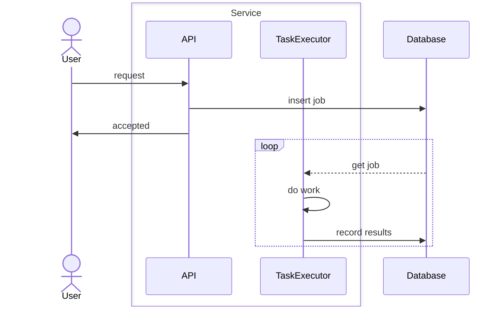

The [inbox pattern](https://en.wikipedia.org/wiki/Inbox_and_outbox_pattern) is an effective means to guarantee delivery of a work item.  You might be familar with it from email.  It is a highly effective way to make sure that work is complete, or retried until it completes.  It is light weight and can be used effectively in much more complex systems like {}, or {}.  It should be adopted before more complex designs.

<!--more-->

> [!NOTE] AKA Outbox Pattern
> The outbox pattern is basically the inbox pattern in reverse.
