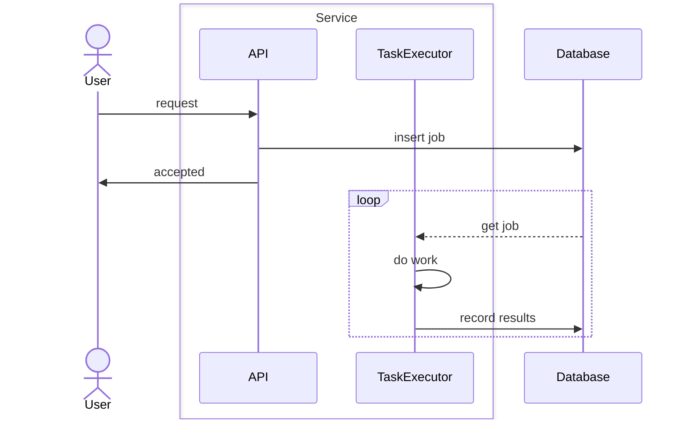

The [inbox pattern](https://en.wikipedia.org/wiki/Inbox_and_outbox_pattern) is an effective means to guarantee delivery of a work item.  You might be familiar with it from email.  It is a highly effective way to make sure that work is complete, or retried until it completes.  It is light weight and can be used effectively in much more complex systems like {}, or {}.  It should be adopted before more complex designs.

<!--more-->

Effectively, the service serializes enough information into the database to perform the work, along with job details such as the date and completion status. If the TaskExecutor might fail before completing a long-running job, use a `reworkAfter` timestamp instead of a simple boolean status. When the TaskExecutor picks up a job, set the `reworkAfter` timestamp to the current time plus twice the maximum allowable time. Any job with a null or expired `reworkAfter` timestamp can be reprocessed. Continue processing all jobs until completion, repeating as necessary.

> [!NOTE] AKA Outbox Pattern
> The outbox pattern is essentially the inverse of the inbox pattern. In this approach, the service writes outgoing messages or events to an outbox table in the database during normal operations. The TaskExecutor then reads from the outbox and sends these messages to external systems or services.
>
> For example, consider an e-commerce application where order confirmations need to be sent to customers. When an order is placed, the service writes the order details to the outbox. A separate TaskExecutor processes the outbox, sending confirmation emails to customers. This ensures reliable delivery even if the email service is temporarily unavailable, as the TaskExecutor can retry sending messages until successful.
